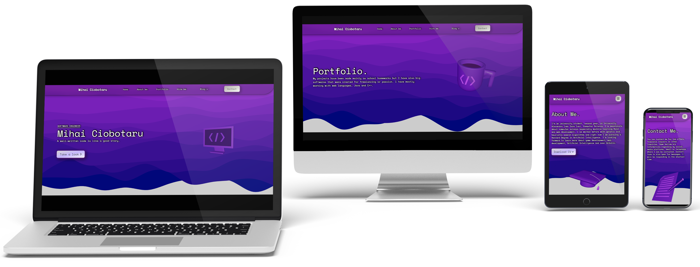

<h1>Hi, welcome to my profile 👋</h1>

- 🏫 I’m an university student, third year, at Universitatea Alexandru Ioan Cuza Iasi, Facultatea de Informatica.
- 🌱 I’m currently learning more about Artificial Intelligence from a Harvard course.
- 💪 I’ve worked mostly with C, C++, Java, PLSQL, HTML, PHP, CSS, SFML, TailwindCSS.
- 😄 I’m familiar with Javascript, ThreeJS, genetic and heuristic search algorithms. 
- 📚 I’m looking forward to learn more about AI, game development, arduino and computer networking.
- 📫 My contact email: contact@mihaiciobotaru.com .
- 👯 My personal website: www.mihaiciobotaru.com .
- ⚡ Fun fact: I'm a certified accountant.

    

# My github stats:

  

# Projects: 

# How to reach me:

